# Site-To-Site VPNの構築

[AWSのSite-to-Site VPN機能だけでAWS VPC同士をIPsecVPN接続する](https://qiita.com/h_nide/items/50902f0e441a8f7f4ddb)

# 仮想プライベートゲートウェイの作成

ここまでCloudFormationで設定済み。

接続元（VPC1）と接続先（VPC2）用に２つ作成する

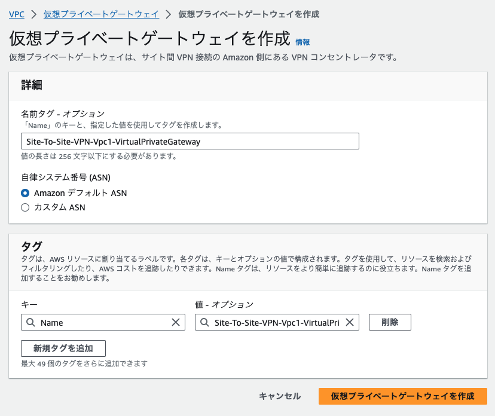
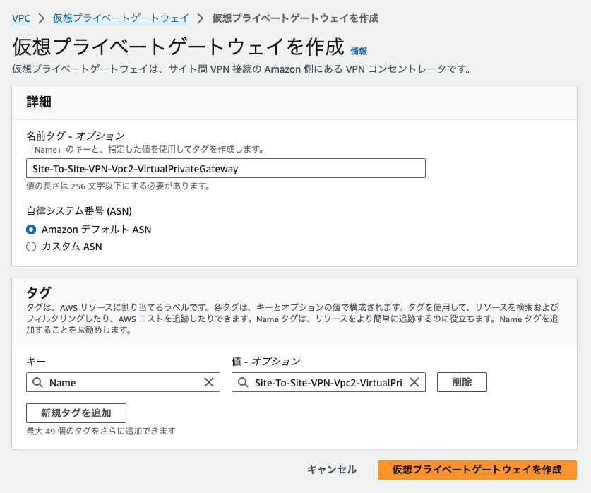

VPC1、VPC2にそれぞれアタッチする

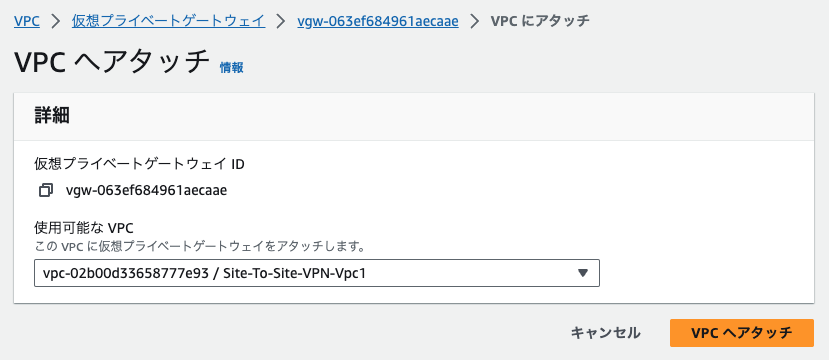
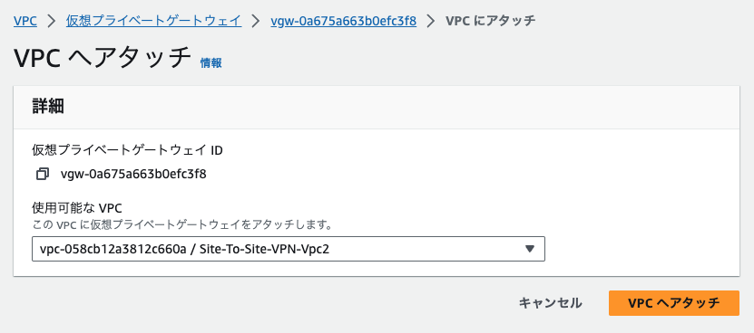

VPC1からVPC2へのルーティングテーブルを作成し作成した仮想プライベートゲートウェイを指定する

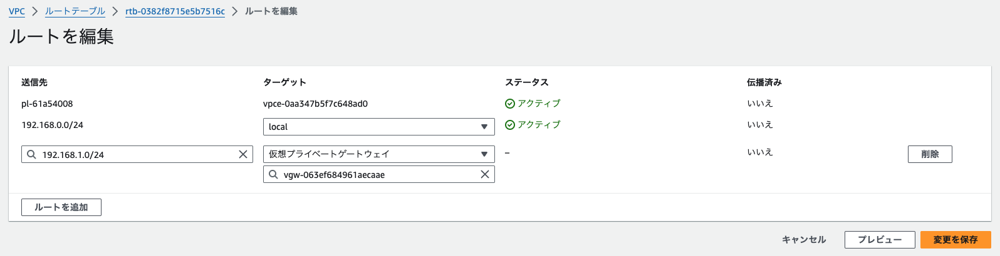
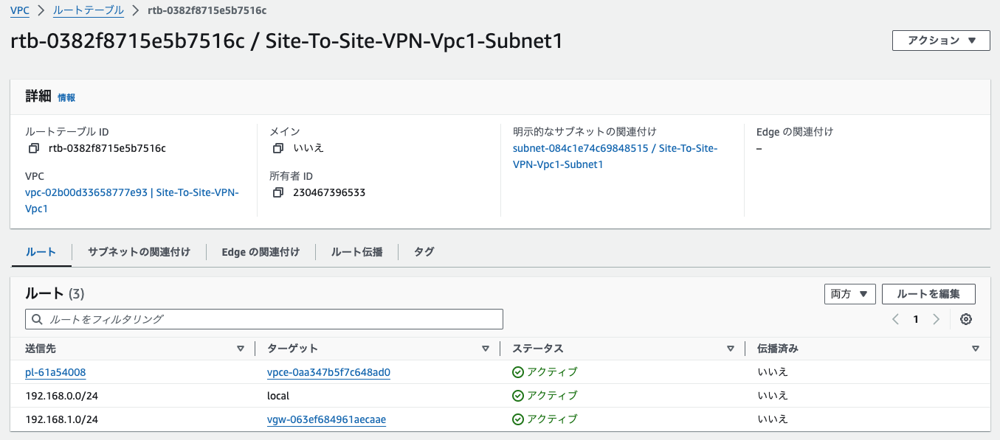

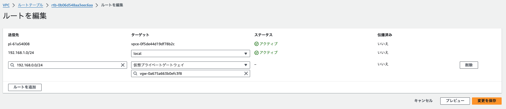
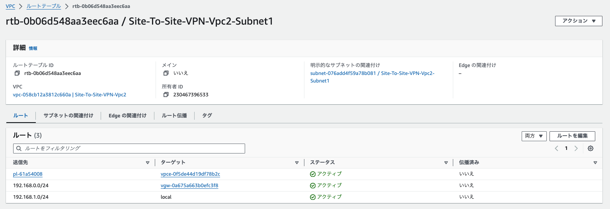

# VPC1からのカスタマーゲートウェイの作成

本来はオンプレミスの情報を登録するが、VPC間の接続なので一旦、仮の値を設定する

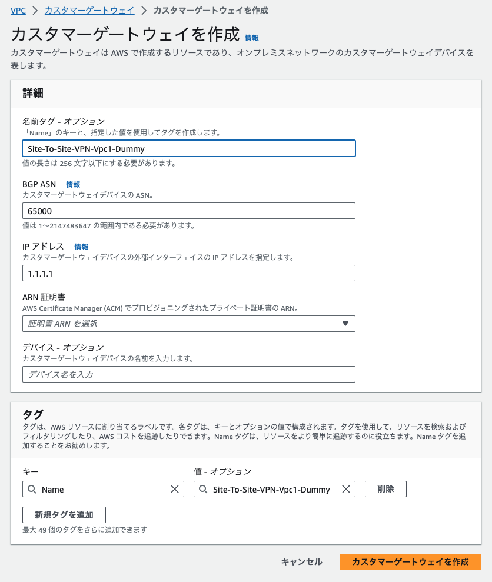

# Site-To-Site-VPNを作成する

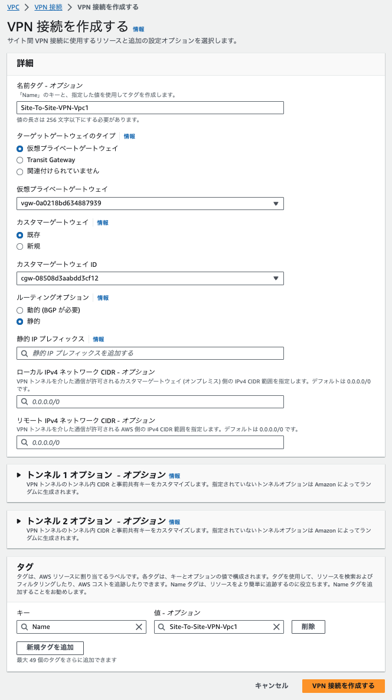

アクティブになるのを待つ

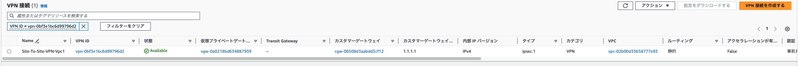

設定をダウンロードする(値はなんでもよい)

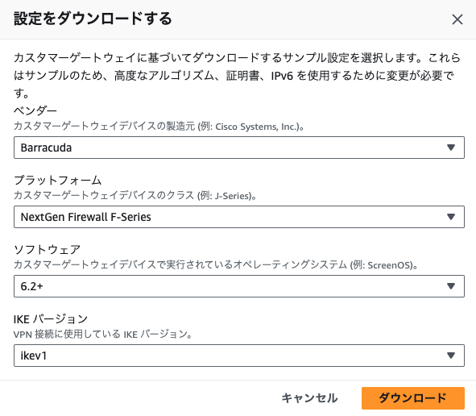

ダウロードした設定をテキストで開き、「PreShared」もしくは「Shared」というキーワードで検索、32桁ぐらいのランダム文字列があるのでその文字列を記録する

tsWwn873iZAVDpa0AiwBZb7c1w_YZOU.

VPN接続の中の「トンネル詳細」タブを選択し、トンネル番号1の「外部IPアドレス」を記録する　・・・　VPC1の接続先IP (3.114.162.183)

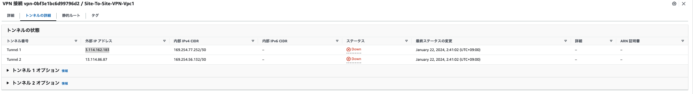

# VPC2からのカスタマーゲートウェイの作成

IPアドレスにはVPC1の接続先IPを指定する

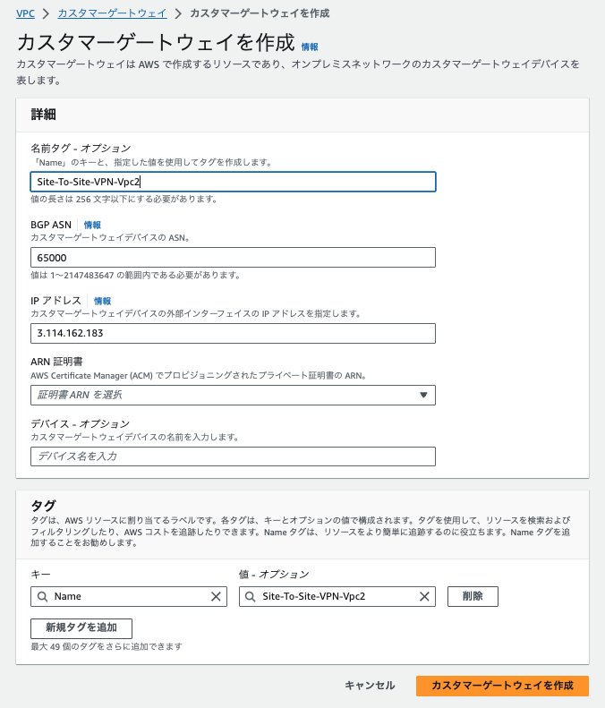

# Site-To-Site-VPNを作成する

トンネル詳細にダウンロードした文字列を指定する

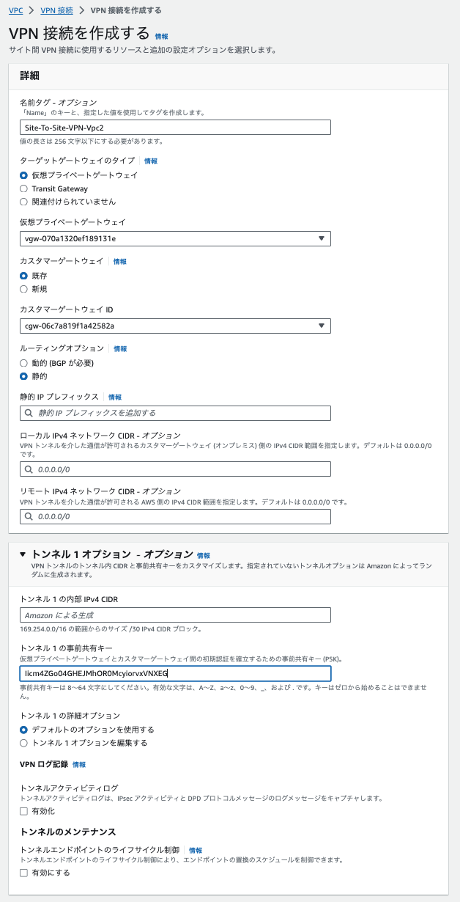

アクティブになったら

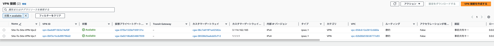

設定をダウンロードしてSharedのキーが一致するか確認する

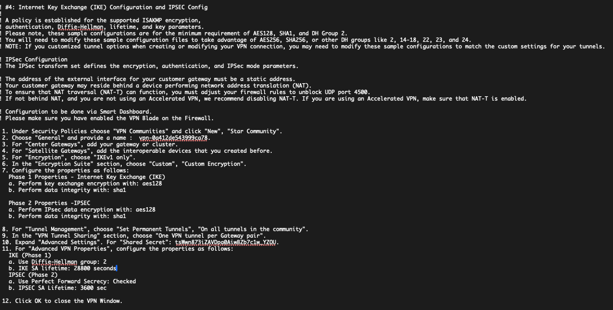

# VPC1からのカスタマーゲートウェイを再作成する

VCP2からのSite-To-Site-VPNのIPアドレスを取得して指定する

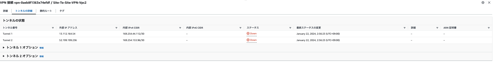

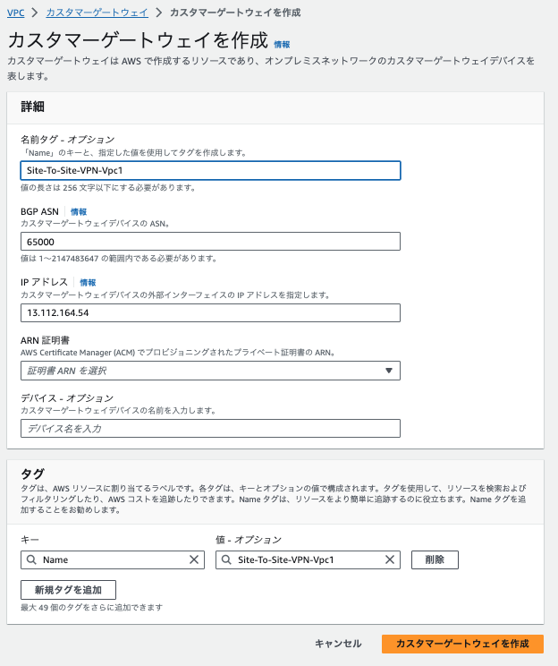

# VPC1からのSite-To-Site-VPNのカスタマーゲートウェイを更新する

VPC 接続オプションを変更する からカスタマーゲートウェイを新しく作成したものに変更する

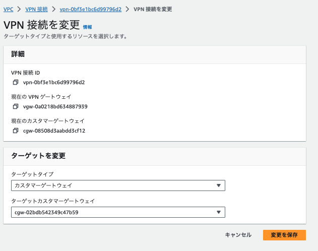

# VPC1からのSite-To-Site-VPNのトンネルオプションを更新する

アクティブになるのを待って、VPC トンネルオプションの変更 から 「スタートアップアクション」で開始を選択して保存

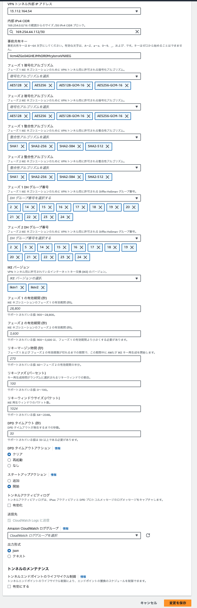

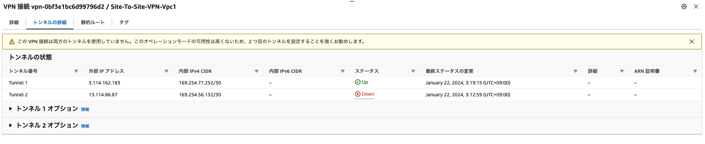
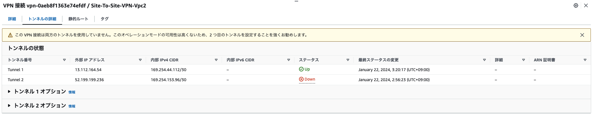