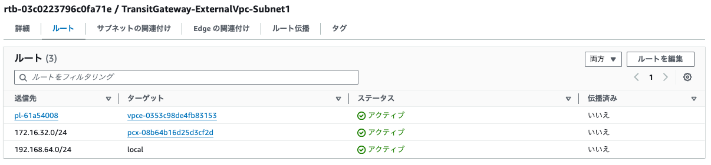

# Transit Gateway の構築

# 構築

## VPC / Subnet

| VPC名        | CIDR            | Subnet             | CIDR            | 説明                          |
|-------------|-----------------|--------------------|-----------------|-----------------------------|
| ExternalVpc | 192.168.64.0/24 | ExternalVpcSubnet1 | 192.168.64.0/28 | VPC Peeringで接続するVPC         |
| GatewayVpc  | 172.16.32.0/24  | GatewayVpcSubnet1  | 172.16.32.0/28  | NatGatewayを配置するVPCの内部Subnet |
| GatewayVpc  | 172.16.32.0/24  | GatewayVpcSubnet2  | 172.16.32.16/28 | NatGatewayを配置するSubnet       |
| PrivateVpc1 | 172.16.33.0/24  | PrivateVpc1Subnet1 | 172.16.33.0/28  | Transit Gatewayを接続する内部VPC   |
| PrivateVpc2 | 172.16.34.0/24  | PrivateVpc2Subnet1 | 172.16.34.0/28  | Transit Gatewayを接続する内部VPC   |

## Route Table


## Transit Gateway 構築

### Transit Gatewayを作成


### Transit Gateway Route Tableを作成


Transit Gateway Route Table


### Transit Gateway Attachmentを作成

GatewayVpc用Attachment


PrivateVpc1用Attachment


PrivateVpc2用Attachment


 
### Transit Gateway Route Table にAttachmentを関連付ける


### VPCのRoute TableにTransit Gatewayを追加



GatewayVpc-Subnet1のRoute Table


GatewayVpc-Subnet2のRoute Table


PrivateVpc1-Subnet1のRoute Table


PrivateVpc2-Subnet1のRoute Table


# EC2にログインして接続確認

秘密鍵を設定

```shell
cd
mkdir -m 755 .ssh
vi .ssh/id_rsa
chmod 400 .ssh/id_rsa
```

```shell
PRIVATE_VPC1_EC2=ip-172-16-33-5.ap-northeast-1.compute.internal
PRIVATE_VPC2_EC2=ip-172-16-34-6.ap-northeast-1.compute.internal
EXTERNAL_VPC_EC2=ip-192-168-64-13.ap-northeast-1.compute.internal
```

PRIVATE_VPC_EC2にログインして検証

同一EC2

```shell
ssh -i .ssh/id_rsa ec2-user@${PRIVATE_VPC1_EC2}
```

```shell
Last login: Wed Apr  3 15:23:24 2024 from 172.16.33.5
[ec2-user@ip-172-16-33-5 ~]$ hostname
ip-172-16-33-5.ap-northeast-1.compute.internal
```

Transit Gateway経由

```shell
ssh -i .ssh/id_rsa ec2-user@${PRIVATE_VPC2_EC2}
```

```shell
Last login: Wed Apr  3 15:23:44 2024 from 172.16.33.5
[ec2-user@ip-172-16-34-6 ~]$ hostname
ip-172-16-34-6.ap-northeast-1.compute.internal
```

NAT Gateway経由

```shell
ssh -i .ssh/id_rsa ec2-user@${EXTERNAL_VPC_EC2}
```

```shell
Last login: Wed Apr  3 15:24:46 2024 from 172.16.32.20
[ec2-user@ip-192-168-64-13 ~]$ hostname
ip-192-168-64-13.ap-northeast-1.compute.internal
```


# 参考

- [AWS Transit Gateway を用いて NAT Gateway を集約し、コストを最適化するための経路設計](https://blog.serverworks.co.jp/route-design-for-aggregating-nat-gateways-using-aws-transit-gateway-to-optimize-costs)
- [【Transit Gateway】アウトバウンド通信を集約する環境を構築してみる](https://dev.classmethod.jp/articles/tgw-outbound-aggregation-in-an-account/)
- [AWS Transit Gatewayとは？特徴やユースケース、料金を解説](https://www.ashisuto.co.jp/db_blog/article/aws-transitgateway.html)
- 